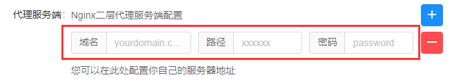

# 梯子原理

1. 通过两层代理，将目标请求链接隐藏在https之中被加密，规避GFW的https握手特征检查
2. 通过二级路径（下图的xxxxxxxx），规避GFW的试探性钓鱼检查


```
浏览器访问：               https://www.google.com    
                                |
DevSidecar【第一层代理】：  https://yourdomain.com/xxxxxxxx/www.google.com/
                                |
GFW：                          GFW
                                |
境外Nginx【第二层代理】：    获取到xxxxxxxx之后的域名和地址，代理到https://www.goolge.com
                                |
DevSidecar：               返回给DevSidecar
                                |
浏览器访问：                返回给浏览器

```

在GFW看来你的流量就是在访问`yourdomain.com`这个正常的网站而已

缺点：
> 1、 仅支持HTTPS     
> 2、 二层代理并没有对tls协议再次封装，仅仅只是简单的代理转发。      
> 所以服务端可以篡改内容，存在安全风险，为了安全，最好是自建服务端。    
> 理论上可以在`yourdomain.com/xxxxxxxx`的wss下封装与目标网站的tls，防篡改，就不需要信任根证书了（有空再研究，现阶段的简单实现已经够用，不介意根证书的话）

总结两点：
> 大道至简：做的越多，错的越多。简单最有效，大隐隐于市。      
> 降维打击：安全我都不要了。(自建服务器可以解决)

## 自建服务端步骤
配置非常简单，会搭nginx即可

###  1. 准备工作
* 一台境外服务器
* 一个域名，免费证书
* 下载[DevSidecar](https://github.com/docmirror/dev-sidecar)

我的服务器是[1核1G的香港主机](https://www.ucloud.cn/site/active/kuaijie.html?invitation_code=C1xF886DAFF2658)       
如果你没有合适的境外主机，可以点击链接去购买，新用户还是挺划算的

### 2. nginx配置

```
你需要定义如下三个变量
域名：yourdomain.com       你注册域名，千万别跟google facebook github这些重点监控的域名相似
路径：xxxxxxxx             你随便乱敲一串字母就行
密码：yourpassword         同上

证书：/xx/ssl证书.crt       绝对路径
     /xx/ssl证书私钥.key
```

```
 server {
    listen 443 ssl;  
    server_name yourdomain.com ; # 修改为你的域名
    ssl_certificate /app/ssl/ssl证书.crt;   # 修改为你域名ssl证书的绝对路径
    ssl_certificate_key /app/ssl/ssl证书私钥.key; # 修改为ssl证书私钥绝对路径
    ssl_session_timeout 5m;
    ssl_protocols TLSv1 TLSv1.1 TLSv1.2 TLSv1.3;
    ssl_ciphers ECDHE-RSA-AES128-GCM-SHA256:HIGH:!aNULL:!MD5:!RC4:!DHE;
    ssl_prefer_server_ciphers on;
    
   
    location ^~/xxxxxxxx/ {  # xxxxxxxx 改成你自己随便任意的前缀地址
        resolver 1.1.1.1 ipv6=off;
        if ( $http_dspassword != 'your password' ){ # 校验密码，如果不配置密码，去掉它即可
            return 404; # 也可以改成403、502等其他错误,最好与下面的返回一致
        }
        if ( $request_uri ~ /xxxxxxxx/([^/]+)/(.*) ){ # 将xxxxxxxx修改为你路径前缀
            set  $_host $1; # 获取路径后的目标网站的域名
            set  $_uri $2; # 获取目标网站的请求地址
         }
        proxy_pass $scheme://$_host/$_uri;
        proxy_redirect https://yourdomain.com/xxxxxxxx/ /;  # 修改为你的域名和路径前缀
        proxy_buffers   256 4k;
        proxy_max_temp_file_size 0k;
        proxy_set_header referer $scheme://$_host;
        proxy_set_header Host $_host;
        proxy_ssl_server_name on;
    }
    location / {  # 其他访问全部拒绝，规避GFW的钓鱼试探
       resolver 1.1.1.1;
       return 404; # 也可以改成403、502等其他错误，最好与上面的密码错误返回一致，或者返回一个伪装网站
    }
}
```
### 3. DevSidecar配置
按如下设置         
应用---> 功能增强 ---> 代理服务端       
填上nginx配置时用的那三个变量，应用即可      
      

> `xxxxxxxx`一定要修改成你自己的，你把它也当成是一个密码        
> 注意保护好 `域名、路径 和密码`，不要公开     
